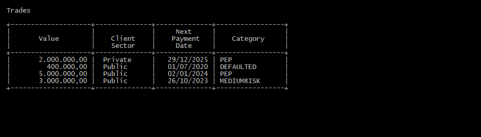

## Question 2

To see Question 2 execute on CLI interface or input a file with expected input

Usage:
```
q1 < input-01.txt
```

Content of file 'input-01.txt'
```
#
# Comments
# 

12/11/2020
4
  2000000	Private		12/29/2025   yes
   400000	Public		07/01/2020   no
  5000000	Public		01/02/2024   yes
  3000000	Public		10/26/2023   no
```

Output:
```
  Trades

  +--------------------+--------------+--------------+-----------------+
  |                    |              |     Next     |                 |
  |       Value        |    Client    |    Payment   |    Category     |
  |                    |    Sector    |     Date     |                 |
  +--------------------+--------------+--------------+-----------------+
  |       2.000.000,00 |  Private     |   29/12/2025 | PEP             |
  |         400.000,00 |  Public      |   01/07/2020 | DEFAULTED       |
  |       5.000.000,00 |  Public      |   02/01/2024 | PEP             |
  |       3.000.000,00 |  Public      |   26/10/2023 | MEDIUMRISK      |
  +--------------------+--------------+--------------+-----------------+
```

Image of output:  


